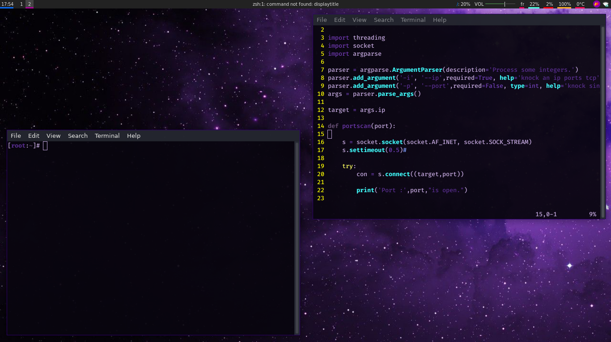
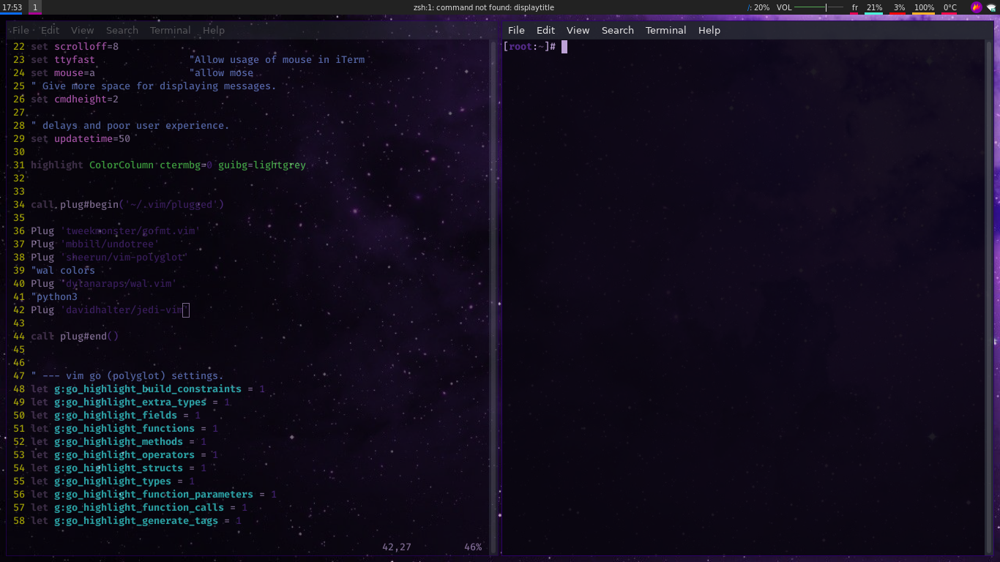

# screenshots




# How to Aply theme ?

> make sure to install this packages
* i3 
* i3-gaps
* rofi
* [pywal](https://github.com/dylanaraps/pywal/wiki/Installation)
* compton
* polybar
```bash
git clonne https://github.com/Ziani52/i3-nebula.git
cd i3-nebula
```
! The Colors depends your wallpaper colors OK :wink:
```
$USER is your username folder in /home 
```
now choose your wallpaper with or use the default in .config/i3/wall02.jpg
```bash
wal -i ~/.config/i3/wall02.jpg #default wallpaper
wal -i /path/to/wall.png # eny error istall pywal Ok
```
& 
```bash
chsh -s /usr/bin/zsh $USER # make sure that zsh is installed
cp .zshrc ~/.zshrc 
cp .xinitrc ~/.xinitrc 
cp .config/* ~/.config/ -r 
chmod +x ~/.config/polybar/polybar.sh
```
by [@0xtz](https://twitter.com/0xtz_52)
